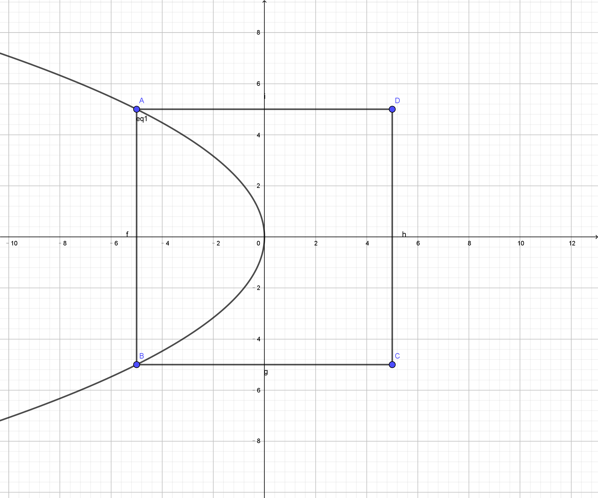
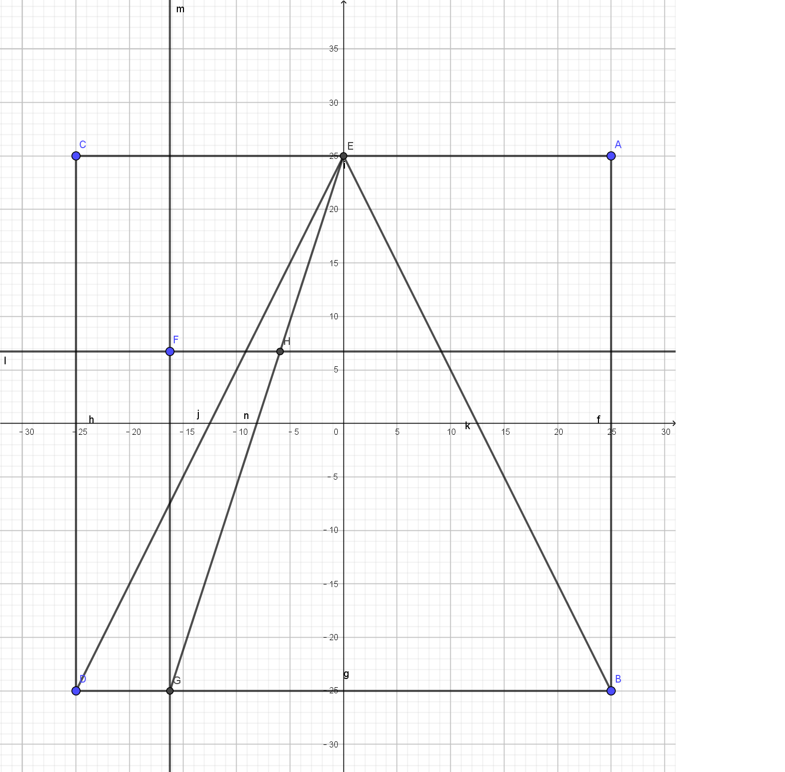

# 算法补偿原理

参考一些论文和jcz补偿方式。基本分为下面四种补偿方法。

- 二次曲线补偿
- 平行四边形补偿
- 梯形补偿
- 平面内补偿

## 二次曲线补偿

该误差来源于振镜在将位置点解析为旋转电机的角度时，会出现一些算术上的偏差（具体来源请参考相关论文），该偏差可以通过一个二次曲线来进行校正。

以一个x方向的补偿为例，如下图：

该情况为一种极端情况，其误差值即为左侧的线到曲线的距离，再乘上一个误差系数即可。

该曲线为二次曲线，根据此正方形的最大值即可确定此二次曲线的方程为：y^2 = (x_max) × x.

对于范围内的每一个点，都可以得到其偏差的二次曲线，从而可以得到误差值。

## 平行四边形补偿

类似于二次曲线补偿，做一个极端情况，如下图：

平行四边形的左上角的点已经偏移到了y轴上。此时根据几何关系即可得到偏差值，然后再乘一个误差系数即可。

## 梯形补偿

类似于平行四边形，做极端情况，就为一个三角形了，三角形的最高点在y轴上的，如下图。

相同的，得到偏差值再乘上误差系数即可。

## 平面内补偿

计算平面内的线性补偿值，较简单，此处省略。
