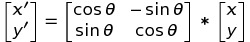

# GalvoScannerCorrect

Galvo scanner correct.
校正振镜算法。

## 补偿原理

振镜由于计算上的问题存在二次曲线的误差，又根据实际安装误差，可能存在平行四边形和梯形的误差。根据相关振镜论文，及参考jcz的相关标定方法，得到此算法。

具体计算过程见[此](GalvoScannerCorrect/doc/readme.md)。

补偿完成之后，因为振镜和伺服轴并非完全平行，故振镜的XY和伺服轴的XY并非平行。此时如果需要实现IFOV功能，就需要将振镜的平面进行旋转到和伺服轴的平面坐标系完全平行。这个旋转使用一般的旋转矩阵即可，如下：

## 编译执行

### 所需环境

- [visual studio](https://visualstudio.microsoft.com/)
- [gnuplot](http://www.gnuplot.info/)

### 执行

打开工程后编译执行，执行完成后，打开`output`下的`*.plt`文件即可看到各种补偿执行后的结果。

## LICENSE

MIT.
